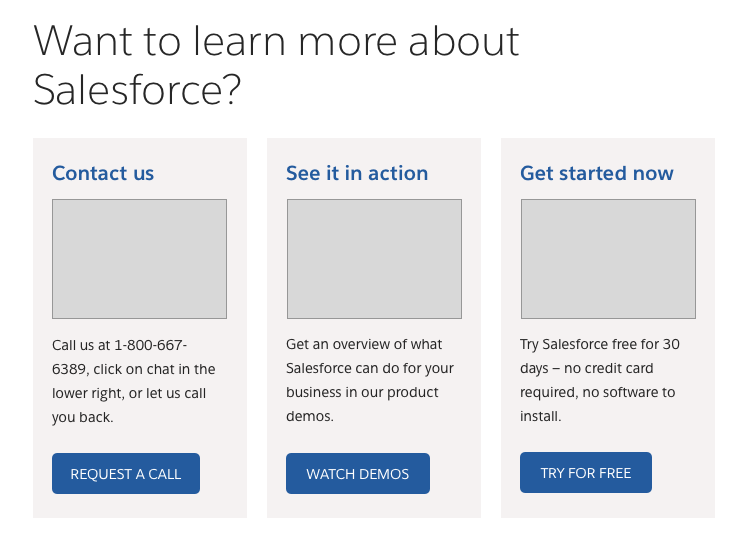

# Salesforce Design System Engineering Test

Hello, and welcome to our developer test! Thank you for considering the Salesforce Design System team for your next career opportunity.

## The Challenge

You are tasked with building a new experience component for our design system. We're calling it a `CardGroup`, and it consists of a headline, along with between one and three `Card` components, which is a component that will also need to be built.

UX Design has given you the following specs, and your challenge is to compose these components within the C360 Component subsystem.

In addition, you were also given this redline spec. You can use it as a guide to assist with component buildout.

Your components will need to adapt successfully to tablet and mobile displays, and will also need to pass AXE Accessibility validation and our test suite.

## Getting Started

To get started, please start by creating a fork of this repository.

Clone the project down locally, run `npm install`, and then run `npm run dev` to start up the development environment.

### Development Prerequesites

To work on this project, you should have some basics installed:

- Node v12 (we encourage use of [NVM](https://github.com/nvm-sh/nvm#installing-and-updating) to manage node versions)
- [VS Code](https://code.visualstudio.com/)
  - [Prettier extension](https://marketplace.visualstudio.com/items?itemName=esbenp.prettier-vscode) installed

### Storybook

This project uses Storybook for its development environment. Storybook is a great way of developing UI components in isolation. It provides conventions for writing "stories" for your components, which are really just ways of showcasing specific states and variations that you need your component to support.

Within Storybook, each component gets a `*.stories.js` file that has a series of exports, with each being what we call a story. Stories are named in CapitalCase and should be named descriptively.

For instance, we have a story called `Base` for our default Button component, along with a story called `Brand` to showcase our Brand Button variant.

We'll talk more about stories below in the Component Structure section, and you can always reference the stories files that exist in our pre-built components to get a better sense of how they function. Storybook supports hot reloading so you can quickly experiment in this environment.

### Elix Web Components

This project makes use of the [Elix Web Components](https://component.kitchen/elix) framework. Elix is a minimalistic WC framework, capable of being run directly in a modern web browser with no compilation or transpilation necessary.

Elix will likely not be a framework you have used before, but it's based in native ES6 Javascript. We encourage you to read through their documentation, as well as review the source code available within this project. The SDS components we have built are all using Elix, and can be used to help guide your path forward.

#### HTML Escape Hatch

If Elix proves to be too much of a struggle, you can compose your stories in HTML directly. The story files we have scaffoled for you already use Elix's built in HTML templating engine, which is simply an HTML string literal. Stories can be written

See `card.stories.js` and `card-group.stories.js` for how you can write your stories with HTML within the Storybook environment.

## Source Code & Component Structure

In this project, all of the source code is within the `src/` folder. We have our components split up into three projects:

- `SDS/` - Our Base Component Subsystem. You will be using these components as you build out your own components. The SDS Engineering team has already built out these components.
- `c360/` - The C360 Subsystem. This is experience component layer where your work will live. We have scaffoled out the components you will need to build, but the rest is up to you.
- `intro/` - Our Welcome component lives here, and you should not need to interact with this directory.

### Component Files

Each component is defined by the following files:

- `{component}.js` The main component JS file, written in the Elix web components framework.

* `{component}.stories.js` The Storybook file for the component, written in [Component Story Format (CSF)](https://storybook.js.org/docs/html/api/csf).
* `{component}.css` The CSS file for the component. Imported by the component JS file and injected into the component's shadow. Feel free to style with whatever means you find comfortable, but do feel encourage to check out source code for other components to get a sense of how we align our selectors. Optionally, you can consider CSS
* `docs.mdx` The MDX-based documentation for the component. Extra credit for your work can be achieved by creating documentation for your component.

## Testing & Validating Code

We have a few methods for teting and validating the code you write. We have eslint and stylelint standards established, those can be run through `npm test`, and are additionally run in our CI environment when Pull Requests are opened.

We also have Axe validation within Storybook, installed as an addon, to assist with Accessibility validation.

## Submitting Your Test

Once you are feeling confident, open a PR on your fork, ensure CI tests pass, and once ready, merge it! Then let us know by providing us with a link to your repository, and ensure that Jade Pennig (zahnster) has access.
